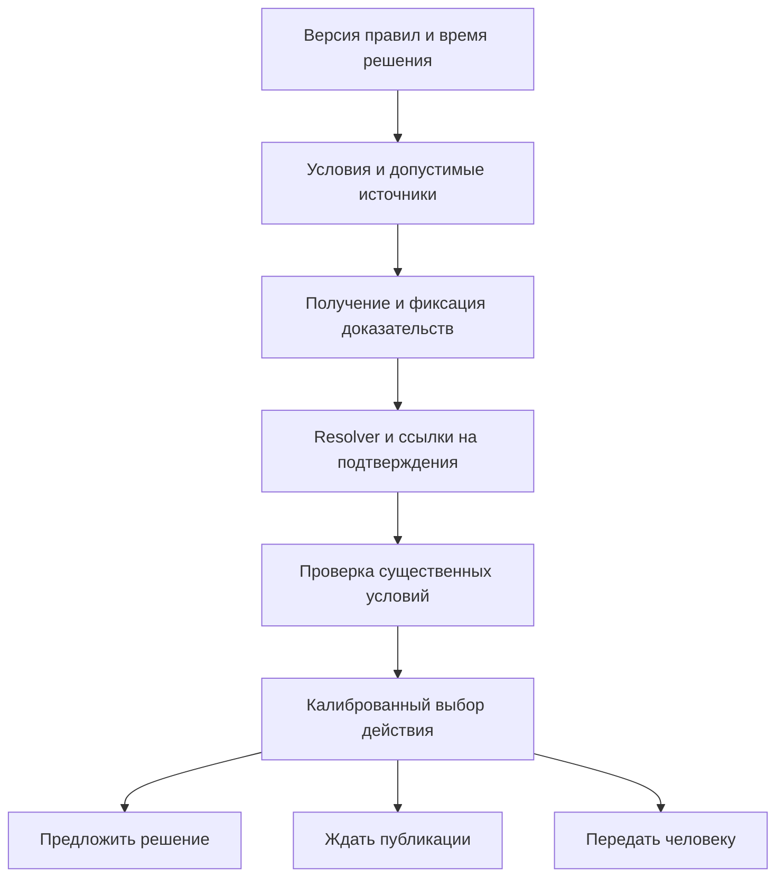

# Agentic Oracle Resolver for Prediction Markets

Исследовательское досье для подготовки к отбору в Фонд «Институт Вега». Срез источников: 30 сентября 2026 года. Статус: обзор литературы, проверка публичных экспериментальных артефактов и протокол будущего исследования. Новое сравнение LLM пока не проведено.

Рекомендуемая тема: **управление риском автоматического разрешения событийных контрактов по проверяемым доказательствам, доступным к моменту решения**. Основной вопрос: позволяют ли признаки достаточности доказательств автоматизировать больше решений при заданном риске ошибки и меньшей полной стоимости? Такое исследование связывает NLP, агентные системы, статистику и экономическую цель проекта.

## Что показать на отборе

Сильная заявка содержит конкретный вопрос, воспроизводимый предварительный результат и эксперимент, способный опровергнуть гипотезу. Для этой темы полезный комплект — двухстраничный proposal, небольшой ноутбук с аудитом, десять разобранных контрактов и план на семестр. Число агентов само по себе не является научным вкладом.

В паспорте группы акцент сделан на самостоятельной постановке задач, регулярном обсуждении результатов, финансовых моделях и подготовке препринтов. Из работ группы полезно посмотреть, как авторы связывают реконструкцию данных, численную проверку и экономическую интерпретацию. Это моя интерпретация исследовательского стиля группы, а не опубликованные критерии отбора. Источники: [паспорт группы](https://drive.google.com/file/d/12TPOnUZIgwpFIEDDRoydAmVaW8NDkSkX/view), [работа о стратегиях предоставления ликвидности](https://arxiv.org/abs/2505.15338).

## Что даёт референсная работа

Kota сравнивает одиночные модели, независимое агрегирование и двухраундовое обсуждение на 1189 строках KalshiBench. Модели получают общий пакет результатов поиска. Заявленная точность лучшего ансамбля — 83,43%, лучшей одиночной модели — 82,42%, обсуждения — 76,11%. Правило единогласия с высокой уверенностью принимает 563 случая, ошибаясь в 12. Отсюда точность 97,87% при покрытии 47,35%. Это полезный исходный результат для selective prediction — системы, которая может отказаться отвечать.

Ограничения для нашей задачи: отбор по уверенности исследован постфактум; обучение полноценной политики передачи человеку оставлено на будущее. Фильтр даты документа допускает день после даты резолва. Упоминание GPT-5 nano в методах расходится с GPT-4o в таблицах. Эти обстоятельства требуют проверки артефактов и протокола, а не автоматического отклонения всех выводов. Общий набор доказательств контролирует условия сравнения моделей, но одновременно создаёт общий канал ошибок. Источник: [Kota, полный текст, методы, таблицы 3 и 12, раздел 7](https://arxiv.org/html/2605.30802v1).

## Результаты первого аудита

Результаты независимого пересчёта сохранённых ответов и проверки данных приведены в сопутствующем ноутбуке и `audit/audit_results.json`. Это проверка опубликованных артефактов без повторного retrieval и inference; она не равнозначна полному воспроизведению исходного эксперимента.

Зафиксирован [репозиторий автора](https://github.com/Tkota10/Senior-Thesis-Multi-LLM-Resolution/tree/f76754b5bcff1a1d7a50c2f1073a4b6d44bd985c), commit `f76754b5bcff1a1d7a50c2f1073a4b6d44bd985c`. Для исходного [KalshiBench v2](https://huggingface.co/datasets/2084Collective/kalshibench-v2/tree/e70c1077093e12ca604429d7f7dc7562127e81f2) сохранён Parquet и revision `e70c1077093e12ca604429d7f7dc7562127e81f2`. JSON-выгрузка viewer не фиксирует revision в URL; hash состояния до и после совпал, но это ограничение отдельно отмечено в manifest.

| Собственный пересчёт публичных CSV | Результат | Интерпретация |
| --- | --- | --- |
| A majority | 986/1189 = 82,93% | Основной показатель воспроизводится |
| A confidence weighted | 992/1189 = 83,43% | Численный выигрыш воспроизводится |
| B до обсуждения, majority первого раунда | 911/1189 = 76,62% | Низкая точность есть уже до обмена аргументами |
| B после обсуждения | 905/1189 = 76,11% | Изменение внутри B составляет −0,50 п.п. |
| Изменения правильности внутри B | 10 правильных решений испорчены, 4 ошибки исправлены | Это более прямое наблюдение эффекта данного второго раунда |
| Единогласные уверенные ответы A | 551/563 правильных, 12 ошибок | Порог медианной уверенности 0,91 даёт тот же результат |

Источник расчётов: сохранённые [ответы A](https://github.com/Tkota10/Senior-Thesis-Multi-LLM-Resolution/blob/f76754b5bcff1a1d7a50c2f1073a4b6d44bd985c/results/Final_Architecture_A_results.csv) и [ответы B](https://github.com/Tkota10/Senior-Thesis-Multi-LLM-Resolution/blob/f76754b5bcff1a1d7a50c2f1073a4b6d44bd985c/results/Final_Architecture_B_results.csv). Мы вычисляли правильность из decision и label, а не просто доверяли сохранённому `is_correct`.

**Главная находка — ограничение причинного вывода о debate.** Большой разрыв A–B нельзя целиком приписать обсуждению: он возникает уже между A и первым независимым раундом B. В коде есть различия промптов и формата входов. В публичных артефактах сохранён частичный кэш evidence: 486 JSON-пакетов. Ожидаемое имя файла и нормализованные ID, вопрос и условия совпадают для 450/1189 строк A и 100/1189 строк B; для 100 общих `row_uid` доступен один и тот же подходящий файл. При этом полная привязка исторических ответов к неизменяемым хешам фактически использованных пакетов не подтверждена. Точный двухсторонний McNemar для 10 против 4 изменений даёт p≈0,180 при обычных предпосылках; это не убедительное свидетельство вреда второго раунда само по себе, а зависимость событий дополнительно ограничивает такой тест. Предлагаемый контроль — разветвить один и тот же первый раунд на голосование, второй независимый ответ и debate.

**Исправление перед публикацией, 30.09.2026:** первоначальное утверждение об отсутствии кэша было ошибочным: правило `cache/` в `.gitignore` не исключает уже отслеживаемые файлы. Независимая проверка покрытия и SHA-256 каждого пакета сохранены в `audit/cache_coverage.json`, код — `audit/audit_cache_coverage.py`. Основные проценты точности от этого исправления не меняются.

Подтверждены и проблемы сопоставления входов. После нормализации пробелов и экранированных переводов строк данные B совпадают с evaluation CSV; в A остаются 35 содержательно отличающихся строк, включая 8 отличающихся labels. Это не означает, что все labels ошибочны: сохранённый запуск мог использовать другую версию контрактов. Нужна сверка с автором. Наглядный пример: один заголовок про ADP employment в A относится к порогу 75000, а в evaluation CSV — к 50000. Одинакового заголовка недостаточно для соединения результатов.

Соединение по вопросу, label и номеру повторения даёт 1170 пар, но в 16 парах различаются resolution criteria. Более строгий ключ, включающий ID и критерии, оставляет 1154 пары; преимущество weighted A над B сохраняется по счётчикам 119 против 37 уникально правильных ответов. Следовательно, обнаруженные расхождения не доказывают исчезновение наблюдаемого преимущества A. Они ограничивают точность сравнения и его причинную интерпретацию.

В evaluation CSV 1189 строк и 703 разных `id`; 486 ID встречаются дважды. Арифметика согласуется. Однако `id` во всех строках равен `series_ticker`: такой идентификатор не следует без проверки считать уникальным контрактом. Случайное разбиение строк и кэширование только по этому полю потенциально опасны; факт конкретной утечки кэша не установлен. В сохранённых ответах ошибок API не обнаружено, но latency заполнена лишь для 739 из 1189 строк каждой архитектуры, поэтому полноценные выводы о времени и стоимости по ним ограничены. Текущий код задаёт `gpt-5-nano`, а `gpt4o_*` сохранено как историческое имя столбца; это само по себе не доказывает запуск другой модели. Точные provider snapshots исторических запусков остаются неподтверждёнными.

Из 12 уверенных единогласных ошибок выделены кандидаты для ручного разбора: вступление тарифов в силу против объявления; фактическая раздача токенов против анонса; недельный рейтинг Netflix против даты заголовка рынка. Это предварительные направления проверки по текстам контрактов, не доказанные причины ошибок. Для 8 из 12 случаев доступны пакеты с совпадающими нормализованными ID, вопросом и условиями; они позволяют перейти к ручному разбору, который пока не проведён. Совпадение полей ещё не доказывает, что исторический запуск использовал именно этот пакет. Все 12 случаев сохранены отдельно.

## Карта литературы и порядок чтения

Основной референс следует читать вместе с кодом и результатами. Следующие работы отвечают на разные части исследовательского вопроса; их проценты нельзя сравнивать как единый leaderboard.

| Приоритет и работа | Зачем читать | Что использовать и чего она не доказывает |
| --- | --- | --- |
| 1. [KalshiBench, Nel, 2025](https://arxiv.org/abs/2512.16030) | Понять происхождение данных и измерение уверенности | Исходная задача — прогнозирование будущих событий. Авторы исследуют 300 вопросов и показывают переуверенность моделей. Для resolution нужно заново задать момент решения и допустимое evidence; forecasting calibration не заменяет calibration корректности резолва. |
| 2. [Can LLMs Help Decentralized Dispute Arbitration, Wen et al., 2026](https://arxiv.org/html/2604.15674v1) | Ближайшая работа о спорных Polymarket рынках | На 259 спорных разрешённых рынках лучший результат — 232 совпадения с UMA. Это agreement с институциональным решением; независимая правильность и перенос на обычные рынки не установлены. Ограничение поиска инструкцией модели ещё не обеспечивает историческую допустимость источников. |
| 3. [Resolution Is Not Settlement, Part I, 2026](https://arxiv.org/html/2609.15368v1) | Правильно определить временные состояния оракла | Различает request, proposal, dispute, reset и terminality; время доступности внешних доказательств не измерено для всей популяции. Исходные материалы реконструкции не распространяются, поэтому это не готовый открытый benchmark для нашего эксперимента. |
| 4. [Resolution Is Not Settlement, Part II, 2026](https://arxiv.org/abs/2609.15373) | Не обещать экономию задержки, которую агент не контролирует | Разделяет результат оракла, протокольную финальность и фактическое получение выплаты. Наше ускорение подготовки решения нужно измерять отдельно от этих этапов. |
| 5. [Pitfalls in Evaluating Language Model Forecasters, Paleka et al.](https://arxiv.org/abs/2506.00723) | Спроектировать проверку временных утечек | Показывает ограничения date-restricted search, заявленных training cutoff и benchmark comparisons. Для resolution информация после события допустима, если уже доступна в выбранный момент решения и соответствует правилам. |
| 6. [Learn then Test, Angelopoulos et al.](https://arxiv.org/abs/2110.01052) | Выбирать порог автоматизации с контролем риска | Формализует выбор параметров через проверку статистических гипотез. Нужна отдельная calibration sample и учёт множественного выбора; guarantees нельзя переносить на произвольный сдвиг распределения. |
| 7. [Mitigating LLM Hallucinations via Conformal Abstention](https://arxiv.org/html/2405.01563v1) | Разобраться, какая ошибка контролируется при отказе | Контроль вероятности «ответил и ошибся» не равен контролю ошибки среди принятых ответов. Нужно явно считать обе величины и покрытие; перенос теории требует её предпосылок. |
| 8. [Debate or Vote, Choi et al., NeurIPS 2025](https://arxiv.org/abs/2508.17536) | Построить честные baselines для multi-agent | На исследованных NLP benchmarks voting объясняет значительную часть выигрыша. Это не теорема о бесполезности любого обсуждения, особенно с новыми доказательствами и разными ролями. |
| 9. [Trust but Verify, Sedoc et al., 2026](https://arxiv.org/html/2605.25133v1) | Сравнить наш verifier с существующим selective prediction подходом | Диалог prover–verifier даёт сигнал для отбора ответов, но полезность зависит от компетентности verifier. Работа не предоставляет автоматической гарантии для событийных контрактов. |

После каждого чтения заполнить пять полей: исследовательский вопрос; единица наблюдения; доступная модели информация; заявленная метрика и её знаменатель; один эксперимент, который проверил бы альтернативное объяснение результата. Это полезнее линейного конспекта.

## Точная постановка задачи

Вход: действовавшая в момент t версия правил контракта R(t), момент решения t, набор допустимых доказательств E(t). Выход: предполагаемый исход, ссылки на подтверждения каждого существенного условия, оценка вероятности корректности и действие системы.

Действия разделены с исходами: `RESOLVE` — предложить решение; `WAIT` — дождаться ещё не опубликованных доказательств; `ESCALATE` — передать человеку неоднозначность или противоречие. YES и NO являются исходами бинарного контракта. WAIT и ESCALATE не означают NO и не меняют юридический набор исходов.

Для Polymarket существуют также Too Early и Unknown/50-50, уточнения правил и этапы оспаривания. Согласно текущей документации, после proposal действует двухчасовое challenge window, а повторный спор приводит к DVM. Наш прототип может ускорять подготовку и проверку proposal; уменьшение этой работы само по себе не отменяет протокольное ожидание. Источник: [Polymarket Resolution](https://docs.polymarket.com/concepts/resolution).

Kalshi определяет исход по условиям контракта и источникам биржи. Для датасета нужны `rules_primary`, `rules_secondary`, а также условия и источники серии: `contract_url`, `contract_terms_url`, `settlement_sources`. Источники: [Kalshi Market FAQs](https://help.kalshi.com/en/articles/13823821-market-faqs), [Get Series](https://docs.kalshi.com/api-reference/market/get-series).

Предлагаю различать три результата оценки: совпадение с финальным решением платформы; соответствие правилам по независимой разметке; наличие достаточных доказательств в реально предъявленном пакете. Они могут расходиться. Финальное решение платформы — доступная proxy label, но не безусловное доказательство фактической правоты.

## Основная гипотеза

**H1. Признаки достаточности доказательств повышают долю автоматических решений при заданном риске ошибки относительно отбора только по уверенности модели.**

Это предлагаемая гипотеза, не установленный результат. Её механизм: модель может быть уверена из-за памяти или правдоподобного пересказа, хотя обязательное условие правил не подтверждено. Признаки evidence должны обнаруживать часть таких ошибок.

Чтобы отдельно проверить политику отбора, сначала зафиксировать ответы одного resolver и общий набор источников. Сравнить четыре selector: raw confidence; правило единогласия и уверенности при наличии ансамбля; калибратор только по confidence; калибратор с дополнительными признаками evidence. При сравнении разных наборов resolver отдельно учитывать дополнительные вызовы и расходы.

Предлагаемые признаки: наличие предписанного первичного источника; доля существенных условий с точной цитатой; соответствие даты и часового пояса; подтверждение нужной сущности; противоречие источников; отсутствие обязательного документа; согласие независимых ответов. Автоматически извлечённые признаки тоже ошибаются — их качество проверяется на ручной подвыборке.

Основной endpoint — coverage при заранее выбранном ограничении selective risk. Для H1 ошибка означает, что автоматическое решение не следует из правил R(t) и доступных к t достаточных доказательств. Угаданный будущий исход без доказательств не считается корректным автоматическим решением. Такое определение требует независимой разметки; для неразмечаемых случаев заранее вводится отдельный статус и анализ чувствительности. Согласие с платформой остаётся вторичной метрикой, а публичный CSV-аудит выше оценивает именно его.

Рабочее предложение для пилота: основной уровень риска α=2%, основной baseline — калибратор только по confidence, минимально полезный прирост покрытия δ=5 п.п. После пилота и обсуждения экономического критерия заморозить эти значения до теста. Поддержка сильной версии H1 требует соблюдения ограничения риска обеими политиками и нижней границы интервала прироста coverage выше δ. Размер выборки рассчитать под этот критерий; при недостаточной мощности результат будет неопределённым. Дополнительный риск 1% и разбиения по категориям обозначить как secondary analyses.

Гипотеза не получает поддержки, если заданный критерий прироста coverage не выполнен; отсутствие статистической определённости не доказывает нулевой эффект. Число временных блоков и проверку устойчивости зафиксировать заранее. Статистическая H1 и экономическая полезность проверяются отдельно: дорогой verifier может повысить coverage и всё же не окупиться. Абляции: убрать временные признаки, убрать source authority, убрать проверку цитат; оставить только confidence. Сравнение с дополнительным вызовом той же модели проверит, объясняется ли выигрыш просто большим бюджетом.

## Дополнительные гипотезы

**H2. WAIT снижает число преждевременных решений без сопоставимого увеличения задержки после появления достаточных доказательств.** На небольшом наборе событий восстановить несколько снимков: до официальной публикации, после публикации, после уточнения. Измерять premature resolution, время до первого обоснованного правильного решения и число обращений к источникам. Одного правильного будущего ответа недостаточно: до доказательств это могло быть угадывание.

**H3. Проверка условий и цитат по запросу дешевле постоянного обсуждения моделей при одинаковых риске и покрытии.** Сравнить один resolver, независимое голосование, debate и каскад resolver → verifier для пограничных случаев. Отдельные показатели: исправленные ошибки, переходы правильного ответа в неправильный, ложные принятия verifier, стоимость retrieval и inference.

На один семестр рекомендую H1 как основную работу, H2 как небольшой тщательно размеченный набор, H3 как дополнительную абляцию при достаточном бюджете. Само добавление отказа, verifier или agent debate не следует объявлять новым научным методом; вкладом может стать строгая оценка и подтверждённое улучшение на контрактных данных.

## Протокол данных и защиты от утечек

Предлагаемый порядок — сначала воспроизвести анализ публичных результатов, затем создать небольшой независимо проверенный набор и только после этого масштабировать inference.

1. Зафиксировать manifest: commit кода, версии моделей и промптов, hash данных, retrieval provider, параметры и timestamp каждого запуска. Сохранять ошибки API; отсутствие ответа является operational failure, а не ответом NO.
2. Разделить `inputs`, `labels` и `evidence`. Исключить из входов settlement result, финальные цены, `is_correct`, тексты решений UMA и страницы рынка, раскрывающие ответ. Разделение файлов не заменяет изоляцию прав доступа при запуске агента.
3. Для evidence хранить URL, полный разрешённый текст или разрешённый снимок, hash, `published_at`, `retrieved_at`, подтверждение `available_at`, версию документа и фрагменты, связанные с условиями. Источники без подтверждения `available_at ≤ t` исключать из основного as-of теста либо выносить соответствующий пример в отдельный анализ с непроверенной исторической допустимостью. То же правило применяется к версии правил и уточнениям.
4. Разделить event deadline, trading close, source publication, время решения агента и final settlement. Позднее опубликованное подтверждение может быть допустимо для позднего решения. Оно не должно попадать в более ранний снимок.
5. Разбивать train, calibration и test по времени и группам событий. Страйки одного события, переформулировки и связанные рынки должны целиком попадать в один split. При кластеризации интервалов учитывать группы, а не считать каждую строку независимой.
6. Размечать спорные примеры двумя людьми независимо, затем согласовывать расхождения. Показывать evidence и правила до финальной platform label там, где это осуществимо. Сохранять причины расхождений; небольшая разметка не превращается автоматически в безошибочный gold standard.
7. Выполнить closed-book контроль и prospective shadow test. Текущая модель может помнить старый результат даже при идеальном retrieval cutoff. Датированная поисковая выдача не доказывает отсутствие параметрической памяти; низкий closed-book результат тоже не доказывает её отсутствия и служит только диагностикой.

Начальный pilot: 50–100 независимых событий, включая текстовые условия, структурированные официальные источники и случаи неопределённости. Это предлагаемый объём для диагностики. Отдельный challenge set спорных рынков полезен, но его распределение нельзя выдавать за обычный поток. Размер большого теста определяется нужной статистической точностью и фактическим coverage.

Пример для разметчиков, полностью условный: контракт требует «официального объявления до 18:00 UTC». Пресс-релиз опубликован в 18:05, но сообщает о решении, принятом в 17:50. Если критерий — именно объявление, время принятия решения его не заменяет. Если критерий — наступление события, интерпретация другая. Такой пример проверяет понимание правил; он не является реальным рыночным кейсом.

## Метрики и статистические ограничения

Обозначим A=1, если система принимает решение автоматически, Z=1, если оно нарушает выбранное определение ошибки. Для primary H1 это необоснованный резолв по R(t), E(t); для secondary — несовпадение с platform label. Тогда `coverage = P(A=1)`, `selective risk = P(Z=1 | A=1)`, а `joint error = P(A=1, Z=1) = coverage × selective risk`. При нулевом coverage условный риск не определён; joint error равна нулю, но это не полезный оракл.

Отчёт должен содержать risk–coverage curve и AURC; точность и количество случаев; Brier score и reliability diagram для вероятности корректности; число WAIT, ESCALATE и operational failures; затраты на входящий контракт и на принятое решение; p50/p95 задержки. ECE зависит от binning и размера выборки — его нельзя использовать как единственное свидетельство калибровки. Калибровка на всех случаях не гарантирует калибровку в принятом хвосте: проверять оба среза.

Порог выбрать на calibration split; тест использовать один раз для зафиксированного gate. Для перебора порогов применять корректный risk-control или multiple-testing протокол. Для сравнений — парные различия на одних контрактах и интервалы, учитывающие группы событий. Значимость различия между ансамблем и debate не доказывает значимость каждого другого сравнения.

Собственный статистический расчёт: при нуле ошибок для фиксированного gate односторонняя 95% биномиальная верхняя граница равна `1 − 0.05^(1/n)`. Для границы 1% нужно не менее 299 независимых принятых случаев, для 0,1% — 2995. На 100 случаях граница около 2,95%. Кластерная зависимость и подбор gate на тех же данных делают эту простую интерпретацию неприменимой. Формула и расчёты реализованы в `src/risk_and_cost.py`.

Теоретические гарантии при exchangeability и эмпирическая проверка на следующем временном блоке — разные утверждения. Если распределение меняется, следует показывать rolling evaluation и чувствительность по категориям, а не обещать безусловную гарантию.

## Экономический критерий

Предлагаемая модель стоимости задаётся для каждого входящего контракта. Все величины приводятся к одной денежной единице:

```text
C_hybrid = C_AI + q × r_A × L + (1 − q) × (C_H,defer + r_H,defer × L)
           + C_delay,hybrid + C_dispute,hybrid
C_human  = C_H,all + r_H,all × L + C_delay,human + C_dispute,human
```

Здесь q — coverage, r_A — ошибка среди автоматически принятых решений согласно выбранной loss model, L — ожидаемый ущерб такой ошибки. Неподтверждённое решение, несовпадение с биржей и неверная выплата могут иметь разные последствия: primary H1 risk нельзя без допущений подставлять как частоту неверных выплат. C_AI включает поиск, модели, повторные вызовы и инфраструктуру. Ошибка и стоимость человека на сложных переданных случаях могут отличаться от значений на всём потоке. При различающихся ущербах считать ожидание по контрактам, а не произведение средних. Задержку переводить в деньги только при явной модели; альтернативно показать frontier стоимости и времени отдельно.

Формула относится к завершённым эпизодам. Для WAIT заранее задать горизонт, учесть повторные расходы, долю незавершённых случаев и их штраф либо отдельную метрику. Если агент лишь готовит proposal, L учитывает вероятность последующего обнаружения и исправления ошибки; расходы, включённые в L, не следует второй раз включать в C_dispute.

Критерий успеха — более низкая полная стоимость при соблюдении ограничения риска и операционных сроков. Для отдельно рассматриваемого случая, после уже понесённых общих затрат, автоматизация предпочтительна, если ожидаемые дополнительные потери и задержка ниже стоимости передачи человеку. Это decision rule; конкретные пороги нельзя получить без данных о loss и human review.

Иллюстрация, не оценка реальной экономики рынка: предположим C_AI=$0,05 на входящий случай, C_H=$5, человек безошибочен, дополнительная цена задержек и споров нулевая. При q=563/1189 и r_A=12/563 получаются следующие значения. Они иллюстрируют чувствительность к ущербу; это арифметика по опубликованным счётчикам, а не новое измерение качества.

| Ущерб ошибки L | Полная стоимость гибрида на входящий случай | Полностью ручной разбор |
| --- | --- | --- |
| $100 | $3,69 | $5,00 |
| $1000 | $12,77 | $5,00 |
| $10000 | $103,61 | $5,00 |

При этих допущениях экономия исчезает около L=$229,63. Объём торгов нельзя автоматически принимать за L, а возвратный bond — за израсходованную сумму: нужны отдельные модели риска потери залога, стоимости блокировки капитала, исправления решения и репутационного ущерба. У группы следует запросить целевую экономическую интерпретацию.

## Минимальный агент и первые эксперименты



Сначала достаточно Python, JSONL/Parquet, скрипта оценки и notebook. LangGraph полезен, когда появляются реальные переходы состояния, повторный поиск и лимиты бюджета. ClickHouse имеет смысл для растущего журнала событий, источников и трасс; он не нужен, чтобы проверить первую гипотезу. LaTeX подключается для оформления стабильного результата. Это предлагаемая последовательность реализации, а не требование конкретной библиотеки.

Baselines: deterministic resolver для контрактов с точным API источника; один LLM с фиксированным evidence; тот же LLM с отказом по confidence; независимое голосование; предлагаемый selector. Первые сравнения проводят с общим evidence. Эффект активного retrieval проверяют отдельным экспериментом с учётом дополнительного бюджета.

В shadow live агент сохраняет решение и доказательства до официального результата, затем evaluator присоединяет label. Такой режим помогает проверить drift и временную честность. Публикация proposal, транзакции и участие в арбитраже не входят в этот исследовательский старт.

## План подготовки и семестра

Пока срок отбора неизвестен, рабочее предположение — около недели на подготовку, затем один семестр на исследование. Это план, а не обещание завершить все модели за неделю.

| Период | Результат, который можно показать |
| --- | --- |
| Первый день | Прочитать основной референс, запустить аудит, уметь объяснить метрики и ограничения |
| Дни 2–3 | Вручную разобрать 10 контрактов: условие, источник, время доступности, решение и причина отказа |
| Дни 4–5 | Подготовить pilot manifest, зафиксировать H1, baselines и критерий опровержения; при бюджете выполнить небольшой inference |
| Дни 6–7 | Собрать двухстраничный proposal, notebook и короткую презентацию; отрепетировать обсуждение альтернативных объяснений |
| Недели 1–2 семестра | Уточнить доступные данные, экономический критерий, модельные версии; завершить репликацию |
| Недели 3–5 | Разметить пилот, заморозить датасет и протокол splits; оценить достаточность выборки |
| Недели 6–8 | Провести baselines, калибровку и основной эксперимент H1 |
| Недели 9–11 | Проверить абляции, временной перенос, H2 и shadow live |
| Недели 12–14 | Выполнить экономический анализ, error analysis и подготовить препринт |

Развилки заранее: нет достоверных исторических снимков — ограничить ретроспективные утверждения и усилить prospective collection; мало принятых независимых случаев — не заявлять риск 1%; признаки evidence не помогают — опубликовать диагностический результат и определить, какие ошибки они пропускают; стоимость verifier слишком велика — проверить вызов только на пограничных случаях.

## Черновик формулировки для заявки

«Меня интересует политика автоматического разрешения событийных контрактов с контролируемым риском. Предлагаю проверить, повышают ли признаки достаточности и временной допустимости доказательств долю автоматических решений относительно отбора по уверенности LLM. Для этого планирую воспроизвести анализ базовой работы, построить набор контрактов с версионированными правилами и разделением входов и финальных исходов, сравнить политики отбора на временном тесте. Основные метрики — ошибка среди принятых решений, покрытие, калибровка, стоимость и задержка. Новизну хочу искать в подтверждённом улучшении этой границы и воспроизводимом протоколе оценки. Начальный аудит публичных результатов и скрипты сбора данных подготовлены; новый LLM-эксперимент и проверка экономического критерия ещё предстоят».

Перед отправкой адаптировать текст под собственный опыт и уметь самостоятельно объяснить каждый сделанный расчёт. Не приписывать себе запуск моделей, разметку или результаты, которых пока нет.

## Вопросы научному руководителю

1. Целевая роль системы — помощь человеку, подготовка proposal или финальное автоматическое решение? Как определяется неприемлемая ошибка?
2. Есть ли исторические evidence snapshots, версии правил, dispute labels и реальные затраты человеческого разбора?
3. Какой экономический критерий предполагается: расходы оператора, риск потери bond, ущерб пользователям или совокупные издержки?
4. Какие модели, поисковые сервисы и бюджеты доступны? Можно ли получить кэш источников и точные версии моделей референсного эксперимента?
5. Допустим ли основной вклад в виде benchmark и строгого selective-resolution протокола, если новая архитектура не даст выигрыша?

Смысл этих вопросов — снять неопределённость экспериментальной постановки. До встречи уже можно показать конкретные артефакты и объяснить, какое решение изменится в зависимости от ответа.

## Как воспроизвести подготовительные результаты

Команды ниже выполняются из корня клонированного репозитория. Ноутбук `first_steps.ipynb` показывает результаты аудита, расчёт риска и проверку выгрузки. Скрипты Python используют публичные данные; повторный inference и платные API не нужны.

```bash
cd agentic-oracle-research
python3 audit/audit_public_artifacts.py
python3 audit/audit_cache_coverage.py
python3 src/risk_and_cost.py
```

Проверить параметры collector через `python3 src/collect_kalshi.py --help`. Сохранённая выгрузка — техническая проба доступности данных, не репрезентативный benchmark. Текущие правила, скачанные задним числом, не доказывают наличие той же версии на исторический cutoff.

Успешно получены 100 закрытых рынков Kalshi: 32 события, 19 серий, 50 Sports и 50 Climate/Weather. У всех есть primary/secondary rules и URL источников; полные данные пяти серий дают ссылки на contract terms для 69 рынков, для остальных 31 недостающие сведения явно отмечены. 14 групп повторяющихся событий охватывают 82 рынка — полезная демонстрация зависимости строк. Входы и labels разнесены; проверка запрещённых outcome-полей пройдена. Источники доказательств ещё не скачивались и историческая доступность правил не восстановлена. Это выполненный smoke test, а не результат resolver.

Данные API меняются. Collector сохраняет timestamp, SHA-256 raw responses и historical cutoff. Для старых settled рынков требуется исторический API; подробности в [Kalshi Historical Data](https://docs.kalshi.com/getting_started/historical_data). При повторной выгрузке сравнивать manifest, а не ожидать неизменности сегодняшней выборки.

Досье отделяет прочитанные источники, собственный пересчёт, предложенные гипотезы и будущие эксперименты. Новизна сформулирована предварительно: найденные связанные работы ограничивают допустимые claims, но не заменяют полный библиографический поиск перед препринтом.
